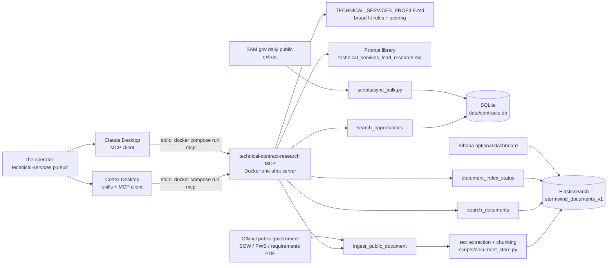
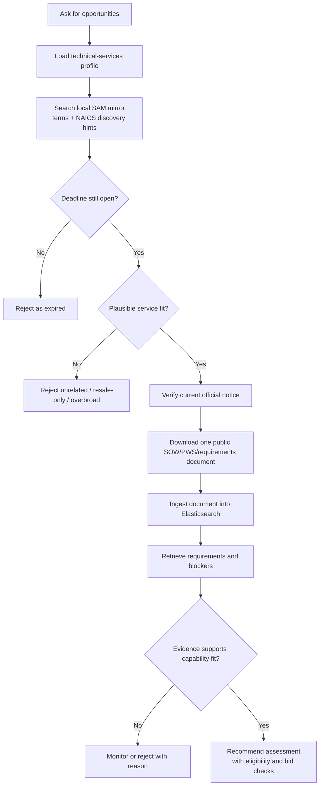

# Technical Opportunity Research Architecture

## System Schematic

## Research Flow

## Runtime Responsibilities

| Component | Responsibility |
| --- | --- |
| Codex skill | Guides the research workflow and output quality. |
| Claude Desktop | Uses the same MCP tools without requiring Codex skills. |
| Docker MCP server | Presents controlled research tools to either AI client. |
| SQLite mirror | Fast discovery from SAM.gov bulk opportunity records. |
| Elasticsearch | Searchable evidence store for public solicitation documents. |
| Profile/prompt files | Define the operator's technical capability lanes and research rules. |

## Boundary Rules

- SQLite finds candidates; it is not proof that a notice remains open or fits.
- Official public notice data verifies status and deadlines.
- Deadline filtering uses the operator's configured timezone, not container UTC.
- Public scope documents establish technical fit and blockers.
- Elasticsearch preserves retrievable evidence; it does not create missing facts.
- A set-aside is worth surfacing, but eligibility must be confirmed separately.
