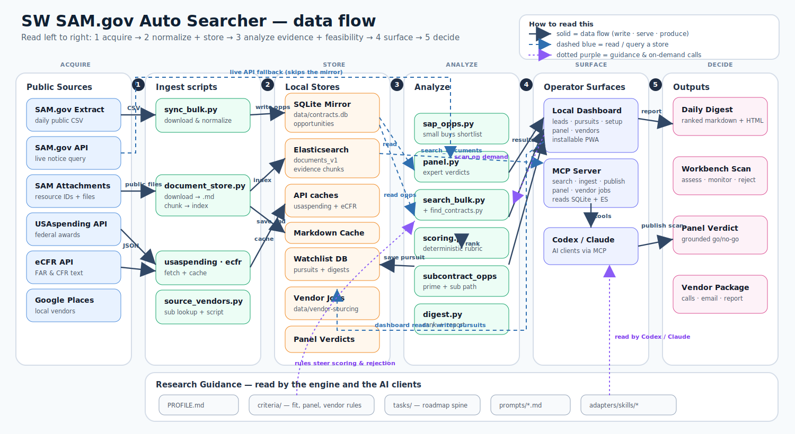

# SW SAM.gov Auto Searcher

Local tools for finding, filtering, and researching public SAM.gov technical-services opportunities.

This project keeps a fast local mirror of SAM.gov opportunity data, stores public solicitation documents in a searchable evidence index, and exposes the workflow to AI clients through a Dockerized MCP server.

> **v2 update.** The toolkit now includes a deterministic lead-scoring engine, a watchlist + saved-search store, a daily digest report generator, and a zero-dependency local web dashboard. See [V2_FEATURES.md](V2_FEATURES.md). The v1 snapshot is preserved at `..\SW_Contracting_Bots_v1_backup\` and at git tag `v1.0`.
>
> **Stage 1 spine.** [`PROFILE.md`](PROFILE.md) is now the living business profile. Business workstreams live as markdown task files in [`tasks/`](tasks/) and are managed via `swcb tasks ...`. The scoring rubrics moved to [`criteria/`](criteria/). See [STAGE1_SPINE.md](STAGE1_SPINE.md) and [ROADMAP_REVIEW.md](ROADMAP_REVIEW.md).
>
> **Stages 2–5.** USAspending incumbent analysis, eCFR clause grounding, Goose recipes, IMAP email scaffold, phone-accessible dashboard with HTTP Basic + Ask command palette, labeled-gold-set harness (macro-F1 + Cohen's κ), and a DSPy GEPA scaffold for self-evolving criteria. See [STAGES_2_5.md](STAGES_2_5.md).

## System Schematic

<p align="center">
  
</p>

## What It Does

- Downloads the public SAM.gov daily opportunity extract into SQLite.
- Searches opportunities locally in milliseconds.
- Falls back to the live SAM.gov API when current same-day data matters.
- Indexes public solicitation attachments, SOWs, PWS files, and amendments in Elasticsearch.
- Gives Codex and Claude an MCP tool surface for structured opportunity search plus document evidence retrieval.
- Keeps lead research focused on technical services: Elastic/OpenSearch, AI search and RAG, observability/SIEM, AI/data services, and VTC/network engineering.
- **v2:** scores every candidate against the operator's rubric, tracks pursuits in a watchlist, generates ranked daily digest reports, and ships a local web dashboard.

## Quick Start

Install dependencies:

```powershell
pip install -r requirements.txt
```

Create a local environment file:

```powershell
Copy-Item .env.example .env
```

Refresh the local SAM.gov mirror:

```powershell
python .\scripts\sync_bulk.py
```

Run a fast local search:

```powershell
python .\scripts\search_bulk.py "Elasticsearch" --active-only
python .\scripts\search_bulk.py "retrieval augmented generation" --naics 541512 --active-only --json
```

Use the live API fallback only when needed:

```powershell
python .\scripts\find_contracts.py "OpenSearch" --days 14
```

## Document Evidence Index

Start Elasticsearch:

```powershell
docker compose up -d elasticsearch
python .\scripts\document_store.py init
python .\scripts\document_store.py status
```

Ingest a public solicitation attachment:

```powershell
python .\scripts\document_store.py ingest "https://public.example.gov/solicitation.pdf" `
  --notice-id "NOTICE-ID" `
  --solicitation-number "SOL-NUMBER" `
  --title "Solicitation attachment" `
  --json
```

Search indexed evidence:

```powershell
python .\scripts\document_store.py search "required platform and security controls" --notice-id "NOTICE-ID" --json
```

## MCP / AI Client Use

Build the MCP container:

```powershell
docker compose --profile mcp build mcp
```

The MCP server exposes:

| Tool | Purpose |
| --- | --- |
| `get_technical_services_profile` | Load the active fit and exclusion rules. |
| `get_elastic_lead_profile` | Load the narrower Elastic/search-only lane. |
| `search_opportunities` | Query the SQLite SAM mirror with deadline filtering. |
| `document_index_status` | Check Elasticsearch and index health. |
| `ingest_public_document` | Ingest a public HTTPS solicitation document. |
| `search_documents` | Retrieve source-backed document evidence. |

See [MCP_SETUP.md](MCP_SETUP.md) for Codex, Claude Code, and Claude Desktop registration.

## Research Flow

1. Refresh `data/contracts.db` with `scripts/sync_bulk.py`.
2. Search each capability lane with `scripts/search_bulk.py` or the MCP `search_opportunities` tool.
3. Reject closed, unrelated, construction, commodity, and weak keyword-only matches.
4. Verify serious candidates against official public notice data.
5. Ingest a public requirements document for the strongest candidate.
6. Search indexed evidence for technical fit and bid blockers.
7. Recommend `assess now`, `monitor/partner`, or `reject`.

## Tests

```powershell
python -m unittest discover -s tests -p "test_*.py" -v
```

## GitHub Safety

The repository is set up to keep local and sensitive artifacts out of GitHub:

- `.env`
- `data/contracts.db`
- downloaded SAM.gov CSV extracts
- generated lead-export CSV/XLSX files
- Python caches and local runtime files
- private or controlled solicitation attachments

Check before pushing:

```powershell
git status --short --ignored
git check-ignore -v .env data\contracts.db data\ContractOpportunitiesFullCSV.csv
```

## v2 Quick Start

```powershell
# Score the local mirror against the broad profile, last 30 days
python scripts/scoring.py --profile technical_services --min-score 3 --days 30

# Generate today's digest (markdown + HTML written to data/digests/)
python scripts/digest.py --days 3 --min-score 3

# Launch the local web dashboard
python scripts/dashboard.py

# Unified CLI dispatcher
.\swcb.bat search "Elasticsearch"
.\swcb.bat score --profile elastic_only --min-score 4
.\swcb.bat digest
.\swcb.bat watch list
.\swcb.bat dashboard
```

Full v2 reference: [V2_FEATURES.md](V2_FEATURES.md).

## More Detail

- [PROFILE.md](PROFILE.md) is the living Stormwind Contracting business profile (start here).
- [STAGE1_SPINE.md](STAGE1_SPINE.md) explains the markdown-task spine and `swcb tasks` CLI.
- [ROADMAP_REVIEW.md](ROADMAP_REVIEW.md) is the agent policy for "what should I work on next?"
- [STAGES_2_5.md](STAGES_2_5.md) walks through USAspending, eCFR, Goose recipes, email scaffold, phone dashboard, harness, and DSPy GEPA.
- [V2_FEATURES.md](V2_FEATURES.md) covers the v2 scoring engine, watchlist, daily digest, dashboard, and CLI.
- [ARCHITECTURE.md](ARCHITECTURE.md) has the internal architecture notes.
- [SOP.md](SOP.md) has daily operating recipes.
- [DOCUMENT_INDEX.md](DOCUMENT_INDEX.md) explains Elasticsearch document ingest and retrieval.
- [MCP_SETUP.md](MCP_SETUP.md) covers AI-client MCP registration.
