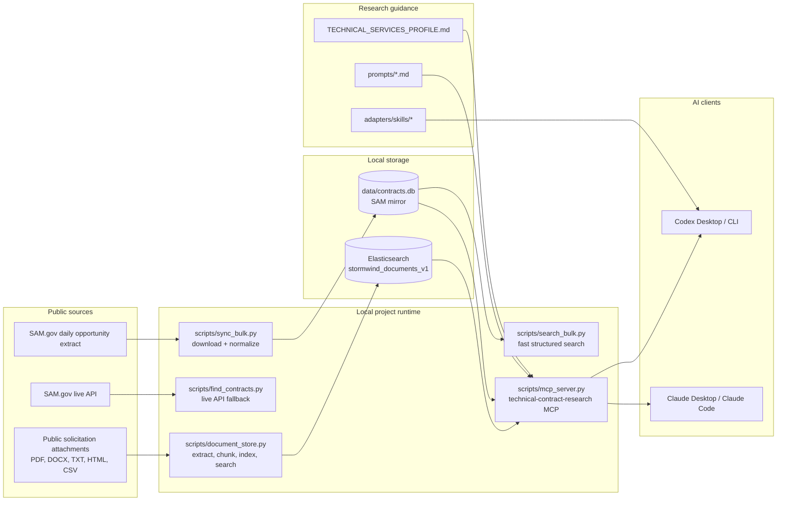

# SW Contracting Bots

Local research tools for finding and evaluating public federal technical-services
contract opportunities. The system mirrors SAM.gov opportunity data into SQLite,
indexes solicitation attachments into Elasticsearch, and exposes both through a
Dockerized MCP server for Codex and Claude workflows.

The active pursuit profile is the operator's technical-services lane:
Elastic/OpenSearch, AI search and RAG, observability/SIEM, AI/data services, and
VTC/network engineering. Construction examples in this repo are historical test
material unless explicitly requested.

## System Schematic



## What Each Layer Does

| Layer | Files | Purpose |
| --- | --- | --- |
| Opportunity mirror | `scripts/sync_bulk.py`, `scripts/search_bulk.py`, `data/contracts.db` | Daily public SAM.gov extract loaded into SQLite for sub-second discovery. |
| Live lookup | `scripts/find_contracts.py` | Optional real-time SAM.gov API search when freshness matters. Requires `SAM_API_KEY`. |
| Document evidence | `compose.yaml`, `scripts/document_store.py` | Local Elasticsearch index for public solicitation files, SOWs, PWS documents, and amendments. |
| MCP server | `Dockerfile.mcp`, `scripts/mcp_server.py`, `.mcp.json` | Gives Codex/Claude controlled tools for opportunity search and document evidence retrieval. |
| Research rules | `TECHNICAL_SERVICES_PROFILE.md`, `ELASTIC_LEAD_PROFILE.md`, `AGENTS.md`, `prompts/` | Keeps lead research focused on realistic technical-services opportunities. |
| Codex skills | `adapters/skills/` | Optional local skills that guide lead scans and document analysis in Codex. |

## Quick Start

Prerequisites:

- Python 3.11+.
- Docker Desktop for Elasticsearch, Kibana, and the MCP server.
- Optional SAM.gov API key for `scripts/find_contracts.py`.
- Optional OpenAI API key only if semantic document search is enabled.

Install Python dependencies:

```powershell
pip install -r requirements.txt
```

Copy the example environment file and fill only the keys you need:

```powershell
Copy-Item .env.example .env
```

Refresh the local SAM.gov mirror:

```powershell
python .\scripts\sync_bulk.py
```

Run a fast local search:

```powershell
python .\scripts\search_bulk.py "Elasticsearch" --active-only
python .\scripts\search_bulk.py "retrieval augmented generation" --naics 541512 --active-only --json
```

Use the live SAM.gov API only when current same-day API data matters:

```powershell
python .\scripts\find_contracts.py "OpenSearch" --days 14
```

## Document Evidence Index

Start Elasticsearch and create the document index:

```powershell
docker compose up -d elasticsearch
python .\scripts\document_store.py init
python .\scripts\document_store.py status
```

Ingest a public solicitation attachment or a local document:

```powershell
python .\scripts\document_store.py ingest "https://public.example.gov/solicitation.pdf" `
  --notice-id "NOTICE-ID" `
  --solicitation-number "SOL-NUMBER" `
  --title "Solicitation attachment" `
  --json
```

Search indexed evidence:

```powershell
python .\scripts\document_store.py search "required platform and security controls" --notice-id "NOTICE-ID" --json
```

Use `--mode hybrid` only after enabling embeddings in `.env` and re-ingesting
documents with embeddings.

## Tests

Run the current unit tests from the project root:

```powershell
python -m unittest discover -s tests -p "test_*.py" -v
```

## MCP Usage

Build the MCP image:

```powershell
docker compose --profile mcp build mcp
```

Claude Code can use the project-level `.mcp.json`. Codex and Claude Desktop
should use the pinned `compose.yaml` command shown in [MCP_SETUP.md](MCP_SETUP.md).

Available MCP capabilities:

| Tool | Purpose |
| --- | --- |
| `get_technical_services_profile` | Load the active fit and exclusion rules. |
| `get_elastic_lead_profile` | Load the narrower Elastic/search-only lane. |
| `search_opportunities` | Query the SQLite SAM mirror with deadline filtering. |
| `document_index_status` | Check Elasticsearch and index health. |
| `ingest_public_document` | Ingest a public HTTPS solicitation document. |
| `search_documents` | Retrieve source-backed document evidence. |

## Recommended Research Flow

1. Read `TECHNICAL_SERVICES_PROFILE.md`.
2. Refresh the SQLite mirror with `scripts/sync_bulk.py`.
3. Search each capability lane independently with `scripts/search_bulk.py` or
   the MCP `search_opportunities` tool.
4. Remove closed, unrelated, construction, commodity, and weak keyword-only
   matches.
5. Verify serious candidates against current official public notice data.
6. Ingest one public SOW, PWS, requirements file, or amendment for the strongest
   candidate.
7. Search the indexed document for technical fit, partner requirements,
   clearance, on-site, certification, vehicle, and submission blockers.
8. Recommend `assess now`, `monitor/partner`, or `reject`.

## GitHub Upload Readiness

This folder is currently inside a larger git working tree at
`<PARENT_PROJECTS_DIR>`. For a clean GitHub upload, treat
`SW_Contracting_Bots` as its own repository.

Do not upload:

- `.env` or any real API key.
- `data/contracts.db`, downloaded SAM CSV extracts, or local document caches.
- Docker volumes, Python caches, virtual environments, or test caches.
- Private or controlled solicitation attachments.

The `.gitignore` is set up for those local artifacts. Before pushing, run:

```powershell
git status --short --ignored
git check-ignore -v .env data\contracts.db data\ContractOpportunitiesFullCSV.csv
```

Create and push a new GitHub repository:

```powershell
cd "<PROJECT_DIR>"
git init -b main
git add .
git status --short
git commit -m "Initial contract research bot system"
git remote add origin https://github.com/OWNER/SW_Contracting_Bots.git
git push -u origin main
```

If using GitHub CLI:

```powershell
gh repo create OWNER/SW_Contracting_Bots --private --source . --remote origin --push
```

## More Detail

- [ARCHITECTURE.md](ARCHITECTURE.md) has the internal architecture and research
  flow diagrams.
- [SOP.md](SOP.md) has daily operating recipes.
- [DOCUMENT_INDEX.md](DOCUMENT_INDEX.md) explains Elasticsearch document ingest
  and retrieval.
- [MCP_SETUP.md](MCP_SETUP.md) covers Codex, Claude Code, and Claude Desktop
  MCP registration.
