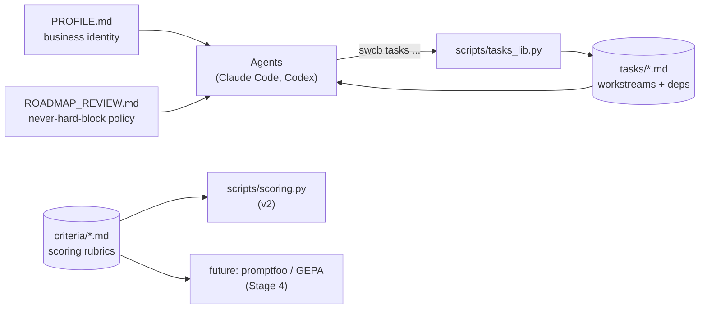

# Stage 1 — The Markdown Spine

This stage delivers what the deep-research report
([`C:\Users\dflaj\Downloads\Research Report.pdf`](C:\Users\dflaj\Downloads\Research%20Report.pdf))
calls **Layer 0 — State (spine)**: a Git-versioned, agent-readable
business state in plain markdown.

## What it is

| Artifact | Role |
| --- | --- |
| [`PROFILE.md`](PROFILE.md) | The living business identity for Stormwind Contracting — operator, NAICS, lanes, certs held/pending, exclusions, tooling stack. Read this first. |
| [`tasks/`](tasks/) | One markdown file per business workstream (cert / registration / bid / infrastructure). YAML frontmatter for status, priority, dependencies. |
| [`criteria/`](criteria/) | The editable scoring rubrics — the "knobs" the v2 scoring engine + the future promptfoo/GEPA harness read. Now contains `TECHNICAL_SERVICES_PROFILE.md`, `ELASTIC_LEAD_PROFILE.md`, `SAM_Lead_Selection_Logic.md`. |
| [`ROADMAP_REVIEW.md`](ROADMAP_REVIEW.md) | The agent policy file. "Never hard-block on one item." Read whenever asked "what's next?" |
| [`scripts/tasks_lib.py`](scripts/tasks_lib.py) | The parser + CLI. Stdlib-only — no PyYAML, no extra installs. |

## How the pieces relate



## Seed roadmap

Seven tasks ship with this stage, wired with real dependencies:

| ID | Title | Status | Depends on |
| --- | --- | --- | --- |
| `001-entity-formation` | Legal entity formed (LLC / corp) with EIN | unknown | — |
| `002-sam-gov-registration` | Active SAM.gov entity registration with UEI | unknown | 001 |
| `003-sdvosb-vetcert` | SDVOSB certification via SBA VetCert | planned | 001, 002 |
| `004-fincen-boi` | FinCEN BOI filing | planned | 001 |
| `005-virginia-swam` | Virginia SWaM + state SDVOSB via DSBSD | planned | 001 |
| `006-eva-registration` | eVA vendor registration | planned | 001 |
| `007-first-micro-purchase-bid` | First micro-purchase bid submitted (validation milestone) | planned | 002 |

Today **only `001-entity-formation` is actionable** — every other
task waits on it. The moment Jeremy flips it to `done`, four
workstreams unblock at once. This is the "never hard-block" behavior
encoded in the dependency graph.

## CLI

```powershell
# What should I work on next?
swcb tasks unblocked

# Show everything
swcb tasks list
swcb tasks list --status planned
swcb tasks list --tag federal

# Inspect one task
swcb tasks show 003-sdvosb-vetcert

# Mark progress (also appends a dated note to the task body)
swcb tasks status 003-sdvosb-vetcert in-progress --note "DD-214 located"
swcb tasks status 003-sdvosb-vetcert pending --note "submitted to VetCert"
swcb tasks status 003-sdvosb-vetcert done --note "approved; cert # XYZ"

# Frontmatter validation
swcb tasks validate

# Next numeric ID for a new task file
swcb tasks next-id
```

## How v2 and the spine coexist

| Layer | What it tracks | Where it lives |
| --- | --- | --- |
| **Spine (Stage 1)** | Business workstreams (certs, registrations, bids, foundational work) | `tasks/*.md` (Git-tracked) |
| **Opportunity watchlist (v2)** | Individual SAM.gov opportunities Jeremy is pursuing | `data/watchlist.db` (SQLite; not in Git) |

The watchlist is the right shape for opportunity-level state — high
churn, structured fields, status-workflow per row. The spine is the
right shape for business-level state — low churn, narrative-heavy,
worth diffing in Git. They don't overlap; they complement.

## Status vocabulary

| status | meaning |
| --- | --- |
| `planned` | Committed-to-do but not started |
| `in-progress` | Active work is happening |
| `blocked` | Cannot advance until a dependency lifts |
| `pending` | Filed / submitted, awaiting external action |
| `done` | Completed |
| `dropped` | Explicitly decided not to pursue |
| `unknown` | Jeremy hasn't told the agent yet (default for new fields) |

`unknown` is intentional — it means "ask Jeremy" rather than the
agent inventing the answer.

## What this stage does NOT include

Stages 2–5 from the report are out of scope here. Specifically:

- No Goose orchestrator install or recipes (Stage 2).
- No USAspending / eCFR / IMAP MCP add-ons (Stage 2).
- No `claudecodeui` chat passthrough (Stage 3).
- No labeled-gold-set harness (promptfoo / DSPy GEPA) (Stages 4–5).

These all stack on top of the spine cleanly once it exists.

## Tests

```powershell
python -m unittest discover -s tests -p "test_*.py" -v
```

Stage 1 adds 11 tests in [`tests/test_tasks_lib.py`](tests/test_tasks_lib.py)
covering frontmatter parsing, status mutation, dependency-graph
unblocked computation, validation, cycle detection, and priority
ordering. 38/38 total tests pass.
