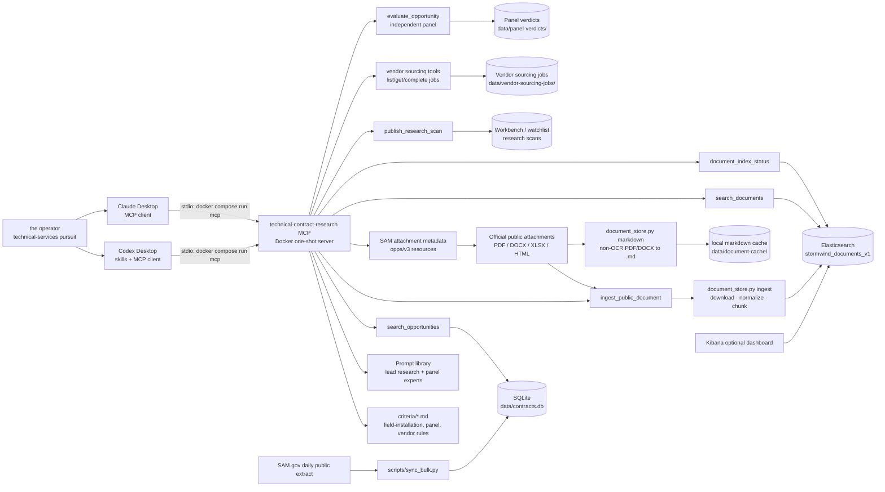
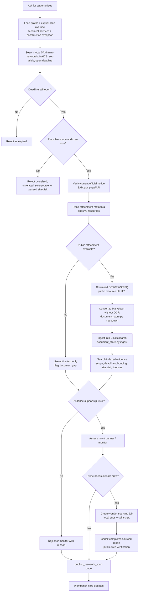
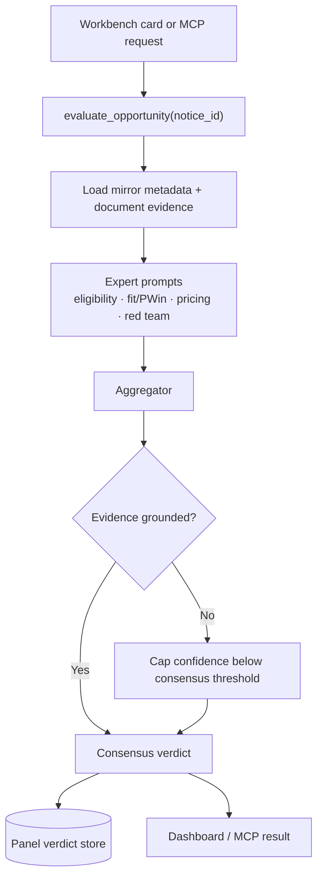
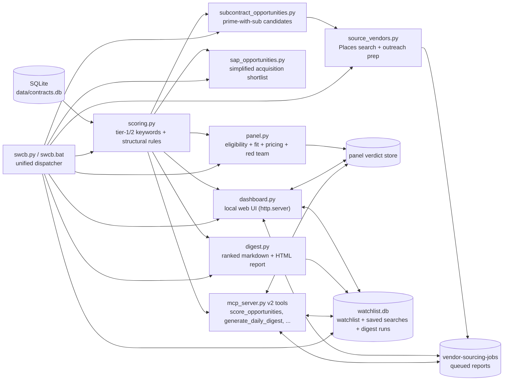

# Technical Opportunity Research Architecture

## System Schematic

## Research Flow

## Decision Panel Flow

## Runtime Responsibilities

| Component | Responsibility |
| --- | --- |
| Codex skill | Guides the research workflow and output quality. |
| Claude Desktop | Uses the same MCP tools without requiring Codex skills. |
| Docker MCP server | Presents controlled research tools to either AI client. |
| SQLite mirror | Fast discovery from SAM.gov bulk opportunity records. |
| SAM attachment API | Lists public solicitation attachment metadata and resource IDs for download. |
| Markdown cache | Optional durable `.md` copy of public SOW/PWS/RFQ files for inspection and debugging. |
| Elasticsearch | Searchable evidence store for chunked public solicitation documents. |
| Profile/prompt files | Define the operator's technical capability lanes and research rules. |
| **Scoring engine** (v2) | Deterministic, explainable lead scoring against the profile rubric. |
| **Watchlist store** (v2) | Per-opportunity pursuit state, status history, saved searches, digest run log. |
| **Digest generator** (v2) | Daily ranked markdown + HTML report by capability lane. |
| **Local dashboard** (v2) | Zero-dependency Workbench for search, scoring, pursuit cards, scans, panel review, and subcontractor sourcing. |
| **Unified CLI** (v2) | `swcb <command>` dispatcher in front of every script. |
| **Panel evaluator** | Independent multi-role review that stores evidence-grounded verdicts before pursuing higher-risk work. |
| **Vendor sourcing** | Sources local subcontractors, generates call/email prep, and lets Codex complete public-source verification reports. |

## v2 Module Flow

## Boundary Rules

- SQLite finds candidates; it is not proof that a notice remains open or fits.
- Official public notice data verifies status and deadlines.
- Deadline filtering uses the operator's configured timezone, not container UTC.
- Public scope documents establish technical fit and blockers.
- Elasticsearch preserves retrievable evidence; it does not create missing facts.
- A set-aside is worth surfacing, but eligibility must be confirmed separately.
